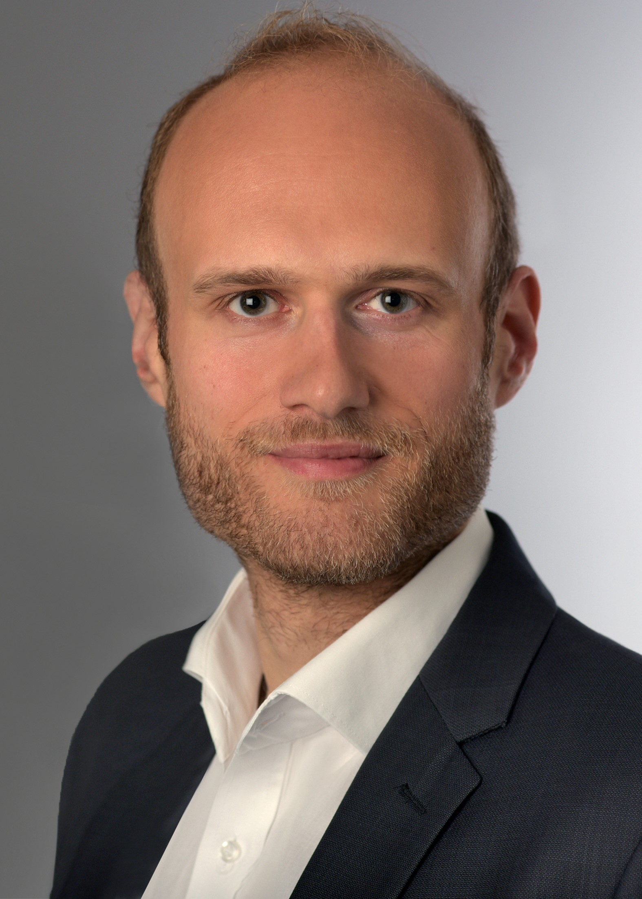

| Time          | Sunday, **03 July 2022**   | Monday, **04 July 2022**    	| Tuesday, **05 July 2022**  |
| ======        | ========================== | =========================== 	| ========================== |
| 08:00  	   	|                            | Registration and Preparation	| Preparation				 |	
| 09:00 	   	|                            | Welcome and Keynote         	| Session 7	    			 |
| 10:00        	|                            | Session 1                 	| _Coffee Break_ and Demos 	 |
| 10:45			|                            | _Coffee Break_ and Demos	   	| Session 8				     |
| 11:30			|                            | Session 2					| Session 9        			 |
| 12:15			|                            | Session 3					| Summary and Closure		 |
| 13:00			|                            | _Lunch Break_ at Mensa		| Networking _Lunch_ at ML2  |
| 14:00			|                            | Session 4					|                            |
| 14:45			| 				             | Session 5					| potential departure		 |
| 15:30			| 				             | _Coffee Break_ and Demos	   	|                            |
| 16:15			| potential arrival			 | Session 6					|                            |
| 17:30			| 				             | Networking Hike to Gabelbach |                            |
| 19:00			| Pre-School Event at BC club| Social Event at Gabelbach	|                            |

## Pre-School Event
The pre-school event will be held on Sunday, **03 July 2022** at [BC-club](https://bc-club.de/) (student club of Ilmenau).
<a href="https://osm.org/go/0GqhODM8D?m=" target="_blank">Location.</a> Starting time: 7 p.m.

_details will be announced soon_ 

## Keynote/Invited Lecture

**Speaker:** Christian Feldmann

**Title:** Video Coding in the Cloud – Challenges and Solutions

**Abstract:** After the rise of video streaming over the internet (OTT) more and more workflows for video transcoding and distribution are moving to the cloud. While this combination can be a match made in heaven, it is full of challenges like a multitude of different video and codecs, streaming container formats, subtitle formats, etc. The talk will give an overview of the transcoding landscape and the biggest challenges that we and our customers are facing. We will talk about codecs and device compatibility, cloud infrastructure, encoders and how some of the biggest names in streaming are trying to solve these problems.

<table class="tg">
<thead>
  <tr>
    <td class="tg-zv4m">**About Christian Feldmann:** He is a video coding engineer at Bitmovin working on next generation video coding technologies in the most recent video coding standards, such as HEVC, VVC and AV1. His main focus points at Bitmovin are practical application of video and transport standards in the scalable cloud transcoding solution. After his study of computer engineering at RWTH University Aachen, he completed his doctoral degree (PhD) at the Institut für Nachrichtentechnik (Institute for Communication Technologies) in Aachen. With his detailed experience in video coding, he is developing video coding technologies for the future of video coding. Christian participates in the standardization activities of the Moving Picture Experts Group (MPEG).</td>
    <td class="tg-8jgo">  </td>
  </tr>
</thead>
</table>

## Social Event
It is planned to have a networking hike towards [Hotel Gabelbach](https://www.hotel-gabelbach.de/en/) right after Session 6 on Monday. There, a joint dinner will take place. 

## Session 1
_to be announced_
## Session 2
_to be announced_
## Session 3
_to be announced_
## Session 4
_to be announced_
## Session 5
_to be announced_
## Session 6
_to be announced_
## Session 7
_to be announced_
## Session 8
_to be announced_
## Session 9
_to be announced_

<!--
**TODO**
-->

<!--
* lab tours (AVLabs, hearing lab, medialab II)
* maybe hiking to a restaurant?

* Lab-Tours & Get-Together: On Sunday, 25 July, there was a Get-Together, including technical tours at the 3IT, CINIQ as well as in the TiME-Lab where participants learned more about the work of the Fraunhofer HHI and its partners.

* Spree Boat Tour: Participants of the Summer School were taken on an evening boat tour on the river Spree in Berlin, where they were treated to a delicious barbecue. The relaxed atmosphere gave them the chance to further exchange ideas after a day of fruitful discussions and to get to know each other even more, while enjoying a beautiful trip through the center of the city.

-->